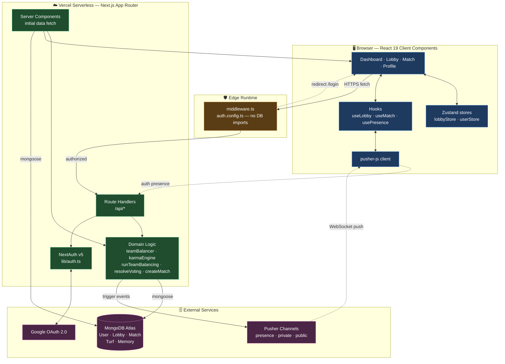
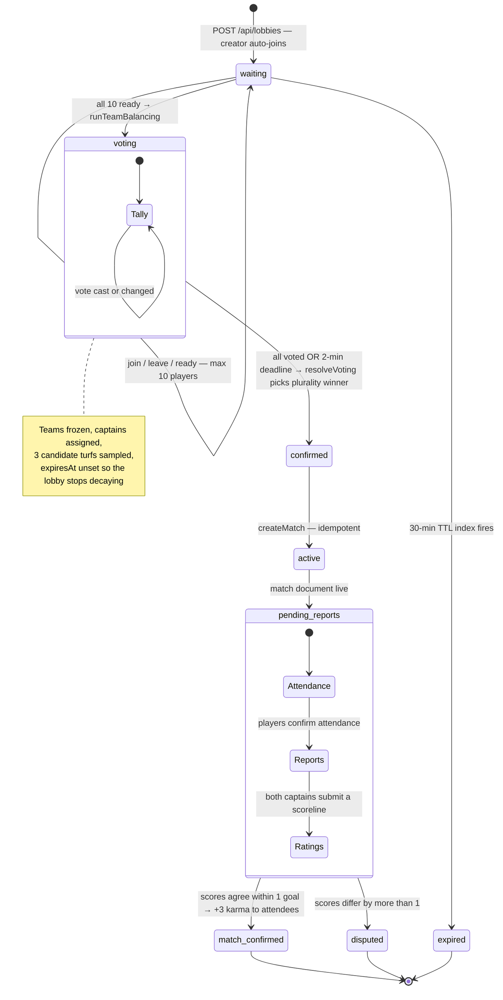
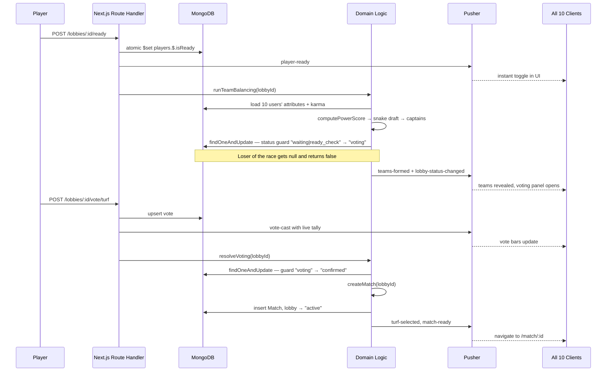
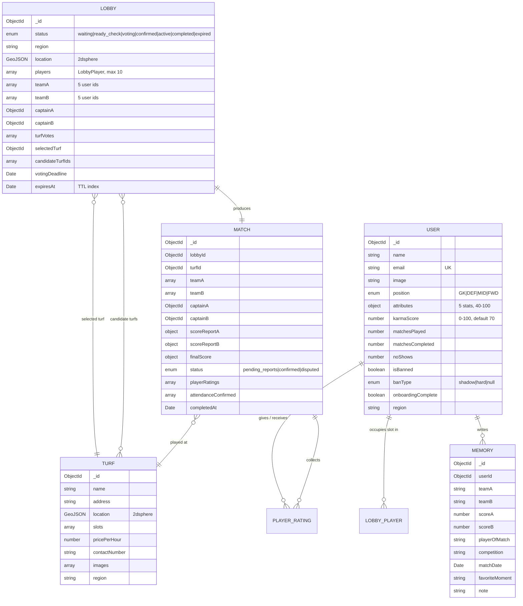

# SquadSync ⚽

**Pickup football, solved.** SquadSync turns ten strangers into two balanced teams on a booked turf — matchmaking, skill-based team balancing, turf voting, score reporting and a reputation system that punishes no-shows.

<p align="center">
  <a href="https://squadsync-qobi.vercel.app/"><strong>🔗 Live Demo → squadsync-qobi.vercel.app</strong></a>
</p>

<p align="center">
  
  
  
  
  
  
  
</p>

---

## Table of Contents

- [The Problem](#the-problem)
- [What SquadSync Does](#what-squadsync-does)
- [Architecture](#architecture)
- [The Match Lifecycle](#the-match-lifecycle)
- [Core Algorithms](#core-algorithms)
- [Data Model](#data-model)
- [Tech Stack](#tech-stack)
- [Getting Started](#getting-started)
- [Environment Variables](#environment-variables)
- [API Reference](#api-reference)
- [Real-Time Events](#real-time-events)
- [Project Structure](#project-structure)
- [Deployment](#deployment)
- [Roadmap](#roadmap)

---

## The Problem

Organising a 5-a-side game is a group-chat nightmare: nobody commits, the teams are lopsided because the same four friends always stack one side, half the squad ghosts on match day, and someone still has to ring around turfs to find a free slot.

SquadSync replaces that with a lobby you join in one tap. Ten players, teams balanced by an actual rating algorithm, turf picked by vote, and a **Karma score** that makes flaking expensive.

---

## What SquadSync Does

| | Feature | Detail |
|---|---|---|
| 🔐 | **Google Sign-In** | NextAuth v5 (Auth.js) with JWT sessions; Edge-safe middleware guards every route. |
| 📝 | **Player Onboarding** | Pick a position (GK / DEF / MID / FWD), self-rate five FIFA-style attributes (40–100), choose a region. GKs get a distinct attribute block — diving, reflex, speed, handling, physical. |
| 🎯 | **Region Matchmaking** | Browse open lobbies in your region, or spin up a new one. Lobbies hold 10 players and self-destruct via a MongoDB TTL index after 30 minutes of sitting in `waiting`. |
| ⚡ | **Live Lobby** | Presence channels show who's actually online. Join / leave / ready-up / chat all propagate instantly to every connected client. |
| ⚖️ | **Automatic Team Balancing** | The moment all 10 players hit ready, a snake-draft over computed Power Scores splits the lobby into two even teams and appoints the highest-Karma player on each side as captain. |
| 🗳️ | **Turf Voting** | Three candidate turfs are sampled from the region. Plurality vote, 2-minute deadline, auto-resolves early once everyone has voted. |
| 📊 | **Score Reporting** | Both captains submit a scoreline. Agreement within 1 goal confirms the match; a wider gap flags it as `disputed`. |
| 👍 | **Peer Ratings & Karma** | Thumbs up/down your teammates. Karma moves live — completion `+3`, no-show `-15`, upvote `+1`, downvote `-2`, clamped 0–100. |
| 🚫 | **Shadow & Hard Bans** | Karma ≤ 40 → shadow ban, ≤ 20 → hard ban and a bounce to `/banned`. Applied automatically on every karma write. |
| 🏟️ | **Turf Directory** | Seeded real turfs (Kollam and more) with address, price/hour, contact and photos. |
| 💾 | **Football Memory Vault** | A personal scrapbook of unforgettable matches — teams, scoreline, player of the match, competition and the moment you'll never forget. |
| 🤖 | **Dev Bot Harness** | Dev-only endpoints spawn 9 bot players who join, chat, ready-up and vote, so the entire 10-player flow is testable solo. |

---

## Architecture

SquadSync is a single Next.js 15 App Router deployment on Vercel. Every mutation goes through a Route Handler that writes to MongoDB **first**, then fans the change out over Pusher — so a dropped WebSocket never corrupts state, it only delays a UI update until the next refresh.



**Design decisions worth calling out**

- **Split auth config.** `auth.config.ts` is DB-free so the middleware runs on the Edge Runtime; `lib/auth.ts` layers on Mongoose callbacks for Node-runtime routes only.
- **Cached Mongoose connection.** A `global.__mongoose` cache stops serverless cold starts from opening a new connection pool per invocation.
- **Atomic state transitions.** Every lobby phase change is a single `findOneAndUpdate` with a status guard, so two players hitting "ready" at the same millisecond can't both trigger team balancing.
- **Pusher failures are non-fatal.** Broadcasts are wrapped in `try/catch`; the database is the source of truth and clients reconcile on refresh.
- **Fail-fast env validation.** `next.config.ts` throws at build time on Vercel if a required secret is missing, instead of failing silently at runtime.

---

## The Match Lifecycle

A lobby is a state machine. Each transition has a trigger, a guard and a broadcast.



And the same flow as it actually moves across the wire:



---

## Core Algorithms

### Power Score & Snake Draft

Raw attributes alone would let a high-skill flake wreck a game, so reliability is baked into the rating:

```ts
attributeAvg = mean(pace, shooting, passing, defending, physical)   // GK: diving, reflex, speed, handling, physical
powerScore   = attributeAvg × (0.7 + (karmaScore / 100) × 0.3)
```

Karma modulates 30% of a player's effective rating. The 10 players are ranked by Power Score and dealt out in a snake pattern:

```
Rank   1  2  3  4  5  6  7  8  9  10
Team   A  B  B  A  A  B  B  A  A  B
```

This keeps the cumulative team power within a few points on both sides while ensuring neither team gets consecutive top picks. Captains are then the highest-Karma player on each team — the person most likely to actually show up and report a score.

### Karma Engine

```ts
newKarma = clamp(
  currentKarma
    + (matchCompleted ? +3 : 0)
    + (noShow ? -15 : 0)
    + positiveRatingsReceived × 1
    - negativeRatingsReceived × 2,
  0, 100
)
```

New accounts start at **70**. Thresholds are evaluated on every write:

| Karma | Status | Effect |
|---|---|---|
| 71–100 | 🟢 Trusted | Priority matchmaking |
| 41–70 | ⚪ Standard | Normal queue |
| 21–40 | 🟡 Shadow ban | Ranked last, warning visible only to the player |
| 0–20 | 🔴 Hard ban | Blocked from matchmaking, redirected to `/banned` |

Ratings apply their delta **immediately** rather than batching at match end, so the rated player's UI updates over a private Pusher channel while they're still on the results screen.

---

## Data Model



**Indexes that matter:** `Lobby.expiresAt` (TTL, auto-purges dead lobbies), `Lobby.location` & `Turf.location` (2dsphere for proximity queries), `User.email` (unique), `User.karmaScore` and `Lobby.status`/`region` for hot matchmaking reads.

---

## Tech Stack

| Layer | Choice | Why |
|---|---|---|
| Framework | **Next.js 15** (App Router, Server Components, typed routes) | One deployment for UI + API, RSC for fast first paint |
| UI | **React 19**, **Tailwind CSS 3.4**, **Radix UI**, **lucide-react** | Accessible primitives, zero-runtime styling |
| Language | **TypeScript 5.8** (strict) | Shared domain types across client & server via `types/index.ts` |
| Auth | **NextAuth v5 / Auth.js** + Google OAuth | JWT sessions, Edge-compatible middleware |
| Database | **MongoDB Atlas** + **Mongoose 8** | Flexible nested docs for lobby slots, TTL & geospatial indexes out of the box |
| Real-time | **Pusher Channels** (presence / private / public) | Managed WebSockets — no stateful server needed on Vercel |
| State | **Zustand 5** | Minimal client store, no provider tree ceremony |
| Hosting | **Vercel** | Native Next.js runtime, preview deploys |

---

## Getting Started

### Prerequisites

- Node.js 20+
- A MongoDB Atlas cluster (free tier is fine)
- A Google Cloud OAuth 2.0 client
- A Pusher Channels app with **client events enabled** (required for presence channels)

### Installation

```bash
git clone https://github.com/Amith-xx/Squadsync.git
cd Squadsync
npm install

cp .env.example .env.local   # then fill in your values
npm run dev
```

Open <http://localhost:3000>.

### Seed the turf directory

```bash
curl -X POST http://localhost:3000/api/dev/seed     # idempotent upsert
curl http://localhost:3000/api/dev/seed             # turf counts per region
```

### Test the full 10-player flow solo

Create a lobby, then fill it with bots — they join, chat, ready up, and vote on their own:

```bash
curl -X POST http://localhost:3000/api/lobbies/<lobbyId>/bots
```

> ⚠️ All `/api/dev/*` routes are gated on `NODE_ENV === "development"` and return 404 in production.

### Scripts

| Command | Does |
|---|---|
| `npm run dev` | Dev server with hot reload |
| `npm run build` | Production build (validates env vars on Vercel) |
| `npm start` | Serve the production build |
| `npm run lint` | ESLint 9 + `eslint-config-next` |
| `npm run type-check` | `tsc --noEmit` |

---

## Environment Variables

Copy `.env.example` → `.env.local`. Every one of these is required.

| Variable | Where to get it |
|---|---|
| `NEXTAUTH_SECRET` | `openssl rand -base64 32` or `npx auth secret` |
| `NEXTAUTH_URL` | `http://localhost:3000` locally; your deployment URL in production |
| `GOOGLE_CLIENT_ID` / `GOOGLE_CLIENT_SECRET` | Google Cloud Console → APIs & Services → Credentials |
| `MONGODB_URI` | MongoDB Atlas connection string |
| `PUSHER_APP_ID` / `PUSHER_KEY` / `PUSHER_SECRET` / `PUSHER_CLUSTER` | Pusher dashboard (server-side — never expose) |
| `NEXT_PUBLIC_PUSHER_KEY` / `NEXT_PUBLIC_PUSHER_CLUSTER` | Same key & cluster, safe to ship to the browser |

**Google OAuth redirect URIs**

```
http://localhost:3000/api/auth/callback/google
https://squadsync-qobi.vercel.app/api/auth/callback/google
```

---

## API Reference

All routes require an authenticated session unless noted. Responses use a discriminated union:

```ts
type ApiResponse<T> =
  | { success: true;  data: T }
  | { success: false; error: string; code?: string }
```

### Auth & Profile

| Method | Endpoint | Purpose |
|---|---|---|
| `GET` `POST` | `/api/auth/[...nextauth]` | NextAuth handlers (Google sign-in/out, callbacks) |
| `POST` | `/api/onboarding` | Save position, five attributes (40–100) and region; flips `onboardingComplete` |
| `GET` | `/api/users/me` | Current player profile, stats and karma |
| `PUT` | `/api/users/me` | Update profile fields |

### Lobbies

| Method | Endpoint | Purpose |
|---|---|---|
| `GET` | `/api/lobbies?region=` | List up to 20 open `waiting` lobbies in a region |
| `POST` | `/api/lobbies` | Create a lobby; creator auto-joins; 30-min TTL |
| `GET` | `/api/lobbies/:id` | Full lobby state — players, teams, votes, candidate turfs |
| `POST` | `/api/lobbies/:id/join` | Atomic join — guards capacity, duplicates and onboarding |
| `POST` | `/api/lobbies/:id/leave` | Leave and broadcast |
| `POST` | `/api/lobbies/:id/ready` | Toggle ready; auto-fires team balancing at 10/10 |
| `POST` | `/api/lobbies/:id/chat` | Post a lobby chat message |
| `POST` | `/api/lobbies/:id/vote/turf` | Cast or change a turf vote; auto-resolves when all have voted |
| `POST` | `/api/lobbies/:id/vote/resolve` | Force resolution at the 2-minute deadline |

### Matches

| Method | Endpoint | Purpose |
|---|---|---|
| `GET` | `/api/matches/:id` | Match state, teams, reports, your submitted ratings |
| `POST` | `/api/matches/:id/attend` | Confirm attendance — gates the `+3` completion karma |
| `POST` | `/api/matches/:id/report` | Captains only. Agreement within 1 goal → `confirmed`, else `disputed` |
| `POST` | `/api/matches/:id/rate` | Thumbs up/down a teammate; karma applied immediately |

### Turfs, Memories & Real-time

| Method | Endpoint | Purpose |
|---|---|---|
| `GET` | `/api/turfs?region=` | Turf directory for a region |
| `GET` `POST` | `/api/memories` | List / create Memory Vault entries |
| `PATCH` `DELETE` | `/api/memories/:id` | Edit or delete an entry |
| `POST` | `/api/pusher/auth` | Presence & private channel authorisation |

### Dev only (404 in production)

| Method | Endpoint | Purpose |
|---|---|---|
| `POST` `GET` | `/api/dev/seed` | Seed turfs / report counts per region |
| `POST` | `/api/dev/reset` | Wipe lobbies and matches |
| `POST` | `/api/dev/complete-match` | Fast-forward a match to completion |
| `POST` | `/api/lobbies/:id/bots` | Fill a lobby with 9 bot players |

---

## Real-Time Events

Channel naming lives in `lib/pusher.ts`:

| Channel | Pattern | Used for |
|---|---|---|
| Lobby | `presence-lobby-{lobbyId}` | Membership, ready state, chat, teams, voting |
| Match | `private-match-{matchId}` | Score reports, confirmation, disputes |
| Region | `public-region-{regionCode}` | New lobby announcements |
| User | `private-user-{userId}` | Personal karma updates |

**Events:** `player-joined` · `player-left` · `player-ready` · `chat-message` · `teams-formed` · `vote-cast` · `turf-selected` · `match-ready` · `score-submitted` · `match-confirmed` · `match-disputed` · `karma-updated` · `lobby-created` · `lobby-available` · `lobby-expired` · `lobby-status-changed`

`useLobby` owns the presence channel subscription; `usePresence` only binds its own handlers and never unsubscribes, so the two hooks can safely share one connection.

---

## Project Structure

```
Squadsync/
├── app/
│   ├── (auth)/                  # login · onboarding
│   ├── (app)/                   # dashboard · lobby/[id] · match/[id] · profile
│   │                            #   each with a streaming loading.tsx skeleton
│   ├── api/                     # route handlers — see API Reference
│   ├── banned/                  # hard-ban landing page
│   ├── layout.tsx  page.tsx  globals.css
├── components/
│   ├── auth/  layout/  providers/
│   ├── lobby/                   # LobbyClient · TeamGrid · TurfVotingPanel · LobbyChat …
│   ├── match/                   # MatchClient · ScoreReportForm · PlayerRatingCard
│   ├── onboarding/  profile/    # AttributeRadar · KarmaBadge · MemoryVault · StatCard
│   └── ui/
├── hooks/                       # useLobby · useMatch · usePresence
├── lib/
│   ├── auth.ts                  # full NextAuth config (Node runtime)
│   ├── pusher.ts                # server + client singletons, channel & event constants
│   ├── regions.ts
│   ├── data/turfs-seed.ts
│   ├── db/                      # connect.ts + models/{User,Lobby,Match,Turf,Memory}.ts
│   └── utils/                   # teamBalancer · karmaEngine · runTeamBalancing
│                                #   resolveVoting · createMatch · applyKarmaUpdates
├── store/                       # lobbyStore · userStore  (Zustand)
├── types/index.ts               # single source of truth for domain types
├── auth.config.ts               # Edge-safe auth config for middleware
├── middleware.ts
└── next.config.ts               # env validation + image remote patterns
```

---

## Deployment

Deployed on **Vercel** at **<https://squadsync-qobi.vercel.app/>**.

1. Import the repo into Vercel — the Next.js preset needs no build config.
2. Add all environment variables from the table above (`NEXTAUTH_URL` = your Vercel domain).
3. In **MongoDB Atlas → Network Access**, allow Vercel's IPs (or `0.0.0.0/0` for a demo deployment).
4. In **Pusher → App Settings**, enable **client events** so presence channels work.
5. Add the production callback URL to your Google OAuth client.

`next.config.ts` validates the required secrets during production builds on Vercel and fails loudly rather than shipping a broken deployment.

---

## Roadmap

- [ ] Real turf slot booking + payment split across the 10 players
- [ ] Geospatial "lobbies near me" using the existing 2dsphere indexes
- [ ] Dispute resolution flow for mismatched score reports
- [ ] Season leaderboards and per-region rankings
- [ ] Push notifications for ready checks and match reminders
- [ ] Attribute drift — ratings that adjust from peer feedback instead of staying self-reported

---

<p align="center">
  Built by <a href="https://github.com/Amith-xx">Amith</a> · <a href="https://squadsync-qobi.vercel.app/">Live Demo</a>
</p>
